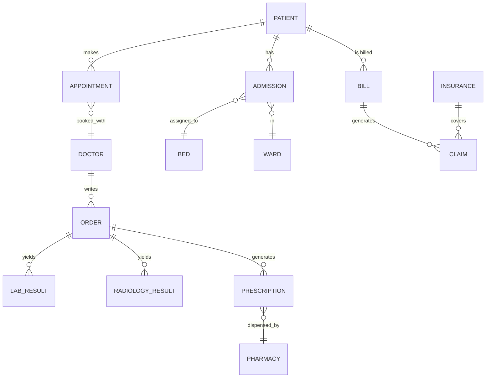
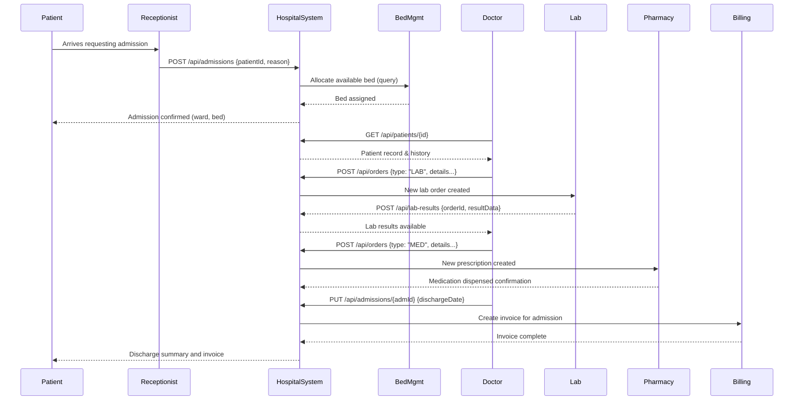

# HMS Architecture & Roadmap

## Executive Summary
Hospitals today suffer from fragmented and inefficient IT systems. Many critical workflows still rely on manual steps and siloed applications, leading to delays, errors, and poor patient experience. For example, a recent industry report notes problems like manual patient data entry, difficulty tracking beds, billing errors, and isolated department systems. Only ~43% of U.S. hospitals routinely share patient data across care settings, and fewer still send records to post-acute providers. These gaps slow patient flow, hinder care coordination, and inflate costs. Hospitals also often lack analytics, mobile access, and patient-facing tools. 

A modern HMS can address these gaps with integrated modules (registration/EMR, scheduling, labs/radiology, pharmacy, billing, etc.) built on standards (FHIR, HL7, DICOM) and modern tech (Java/Spring Boot microservices, React front-end, JWT-secured APIs). In the sections below we:
1. Detail the top IT gaps
2. Propose 10–15 concrete modules to fill them (with architecture/design notes)
3. Compare six leading HMS products
4. Discuss regulatory and security challenges for Java/Spring/React
5. Outline an implementation roadmap (milestones, team, CI/CD)
6. Sketch key APIs and data models (with mermaid diagrams)
7. Recommend testing and monitoring strategies

**Assumptions**: global scope (so note HIPAA/GDPR), cloud deployment on container platforms, and compliance with healthcare interoperability standards (HL7 v2/FHIR, DICOM).

## Industry Gaps in Hospital IT
Hospitals face several unmet needs in digital systems:

- **Data fragmentation and poor interoperability:** Clinical and administrative systems (EHR, lab, pharmacy, billing, imaging) often don’t talk to each other. Only ~43% of hospitals routinely exchange data across systems, and many lack standards-based interfaces (FHIR/HL7) or DICOM imaging support. Critical information (e.g. lab results, medication lists) may not be readily shared, impeding coordinated care. Lower-resourced and smaller hospitals especially lag in interoperability.
- **Manual workflows & patient flow bottlenecks:** Many processes (patient registration, vitals collection, bed assignment) are still done on paper or spreadsheets. This causes long wait times and overburdened staff. For example, one study of 100–500-bed hospitals found “systematic OPD and IPD process” gaps, leading to increased patient wait times and staff overload. Poor bed/ward management is a top challenge. Lacking real-time dashboards, managers can’t see bottlenecks or optimize flow.
- **Billing/claims inefficiencies:** Fragmented billing and insurance systems lead to delays and errors. Many hospitals report billing mistakes (duplicate charges, missing items) and slow claims processing. A modern HMS needs robust invoicing, insurance validation, and claims tracking.
- **Limited patient engagement:** Few systems provide patient portals or mobile apps. Patients have little visibility into appointments, bills, or records. Engaging patients digitally (appointment reminders, telehealth, access to records) remains an unmet need.
- **Asset and inventory management gaps:** Hospitals often lack real-time tracking of assets (wheelchairs, equipment) and drug/inventory stock. This leads to wasted time locating items and stockouts.
- **Data analytics deficits:** Many hospital IT systems lack embedded analytics. Executives have little insight into KPIs (e.g. average length of stay, readmission rates, departmental workload). This impedes continuous improvement.

*In summary, new HMS solutions should focus on seamless data integration (FHIR/HL7/DICOM), mobile/patient interfaces, automated workflows (registration, scheduling, bed management), and embedded analytics to solve these real-world gaps.*

## Proposed Modules & Features
We propose the following high-priority modules (each implemented as a Spring Boot service with a React frontend, secured by JWT/Spring Security, and using PostgreSQL or equivalent):

### 1. Master Patient Index & Registration
- **Frontend:** React forms for patient demographic capture and unique ID generation.
- **Backend:** “Patient Service” (Spring Boot + REST API) exposes endpoints like `POST /api/patients` to create or update patient records. Data stored in a `patients` table (PostgreSQL).
- **Standards:** Use FHIR Patient resource structure as a guide for fields.
- **Security & Access:** JWT-based auth ensures only users with roles (receptionist, clerk) can create patients. Audit logs record every create/update (for HIPAA audit).
- **Integration:** A FHIR-compatible API (e.g. `GET /fhir/Patient/{id}`) allows external systems to query patient info.

### 2. Appointment Scheduling
- **Service:** “Scheduling Service” with React calendar UI. Allows booking/editing appointments with doctors or clinic services.
- **Endpoints:** `GET/POST/PUT /api/appointments`.
- **Relationships:** patient ↔ appointment ↔ provider. Store in `appointments` table (columns: patient_id, doctor_id, time, status).
- **Security:** Spring Security ensures only authorized staff (and optionally patients via a portal) can create/modify their appointments.
- **Data Flow:** front-end sends appointment request JSON, backend validates conflicts, saves to DB, possibly sends reminder (email/SMS) via a notification sub-system. Postgres or CockroachDB recommended.

### 3. Inpatient Admission & Bed Management
- **Service:** “Admission Service” with front-end interface for admission clerks/nurses.
- **Endpoints:** `POST /api/admissions`, `GET /api/wards/{wardId}/beds`.
- **Tables:** `admissions` (patient_id, ward_id, bed_id, admit_date, discharge_date, status) and `beds`/`wards` (ward layout).
- **Workflow:** On admission, system assigns a free bed (algorithm or manual selection). JWT-secured, only roles like Nurse/Admin can admit. Nurses use React dashboard showing ward occupancy.
- **Integration:** HL7 ADT messages from external system can create/update admissions. Ensure transactions: on discharge (`PUT /api/admissions/{id}` with discharge info), free up bed. DB: relational (Postgres). Use caching or Redis for quick bed availability queries.

### 4. Clinical EMR & Order Entry
- **Service:** A core “Clinical Service” holds encounter notes and orders. React UI for clinicians to view/edit patient charts.
- **Data Model:** `encounters` (id, patient_id, doctor_id, datetime, notes). Orders for labs, imaging, meds are stored in `orders` table with type (LAB, RADIOLOGY, MEDICATION), and associated child records (`lab_orders`, `imaging_orders`, `prescriptions`).
- **Workflow:** `POST /api/orders` to place an order; backend routes to lab or radiology. Doctors authenticate via JWT and only see assigned patients.
- **Integration:** Integrate with HAPI-FHIR: the service can emit FHIR ServiceRequest or MedicationRequest resources.
- **Data Flow:** an order goes to the Lab Service or Pharmacy Service, which then updates `lab_results` or marks meds dispensed. Use message queues (e.g. RabbitMQ/Kafka) for inter-service communication.

### 5. Laboratory Information System (LIS)
- **Service:** Dedicated “Lab Service.”
- **Endpoints:** `GET/POST /api/lab-orders`, `GET /api/lab-results`.
- **Workflow:** Lab technicians use React web UI to record results against orders.
- **Data Model:** `lab_orders` (with foreign key to encounters or orders) and `lab_results` (result values, status).
- **Integration:** FHIR integration: Lab Service can store results as FHIR DiagnosticReport and expose via API.
- **Security & Data Flow:** only lab staff roles can write results. On test completion, results are saved; back in EMR service, update patient chart.

### 6. Radiology/PACS Integration
- **Service:** “Radiology Service” handles imaging orders and reports.
- **Endpoints:** `POST /api/imaging-orders`, `GET /api/images/{id}`.
- **Workflow:** When a radiology order is placed, the service notifies a PACS (e.g. Orthanc or DCM4CHE). Imaging files (DICOM) are stored on a PACS server; metadata kept in `radiology_orders` and `reports` tables. React UI lets radiologists view images (via embedded DICOM viewer) and enter findings (report text).
- **Standards:** Use DICOM standards for storage/transfer. Store image references (URLs) in DB. JWT-secured: only radiologists see images. On discharge, imaging reports link to patient EMR.

### 7. Pharmacy & Inventory
- **Service:** “Pharmacy Service” with React interface for medication dispensing and stock tracking.
- **Data Model:** `medications` (master drug list), `inventory` (medication_id, quantity, location).
- **Endpoints:** `GET /api/medications`, `POST /api/prescriptions`, `PUT /api/inventory`.
- **Workflow:** Doctors’ prescriptions (from Clinical Service) are pulled automatically. Pharmacists mark meds as dispensed (`POST /api/dispense`) and the system adjusts inventory. Inventory alerts (low stock) are generated. JWT roles: pharmacist, pharmacy-admin. Optionally use a NoSQL DB (MongoDB) for logging dispensing events.

### 8. Billing & Claims
- **Service:** “Billing Service” for invoicing patients and insurers.
- **Data Model:** `invoices` (patient_id, items, total, status) and `claims` (invoice_id, insurer_id, status).
- **Endpoints:** `POST /api/invoices`, `PUT /api/invoices/{id}/pay`, `POST /api/claims`.
- **Workflow:** When a patient is discharged, system auto-generates an invoice (consultation fees, room charges, pharmacy, lab costs).
- **Integration:** Integrate with insurance: if patient has insurance, auto-create a claim and send via EDI (HL7v2 or FHIR Coverage). Use secure channels (TLS) for claim submission. Audit: every invoice/claim change is logged. DB: relational, possibly multi-tenant partitioning if serving multiple hospitals.

### 9. Analytics & Dashboard
- **Service:** An “Analytics Service” aggregates data for KPIs.
- **Tech Stack:** Use ELK or Prometheus to collect metrics (e.g. average wait time, bed occupancy, revenue). Build a React admin dashboard to display charts. Database: possibly a data warehouse (Postgres or Redshift) that ETLs key data nightly.
- **Endpoints:** Provide REST APIs (e.g. `GET /api/metrics/avg-wait-time`) for the UI. Implement access logs (with severity thresholds) to detect anomalies (e.g. unusually high access).

### 10. Patient Portal & Telehealth
- **App:** A web/mobile React app for patients.
- **Features:** view appointments, lab results, pay bills, and conduct video visits.
- **Endpoints:** Expose secure endpoints under `/api/patient/*`: e.g. `GET /api/patient/appointments`, `GET /api/patient/lab-results`.
- **Security:** Use JWT tokens (with OAuth2 flows) so patients only see their records.
- **Telemedicine:** integrate with WebRTC or third-party API (Twilio, Zoom). UI includes notifications (email/SMS) for reminders.

### 11. Interoperability Module
- **Service:** A background “Integration Service” handles HL7/FHIR messaging. It uses libraries like HAPI for FHIR and HAPI HL7v2 for legacy messages.
- **Functions:** convert incoming ADT (admit/discharge) HL7v2 to update the Admission Service, expose FHIR endpoints for external EHRs, and translate DICOM worklists. Implements HL7 MLLP inbound listeners or webhook bridges.
- **Standards:** Ensures FHIR conformance (R4) for patient, observation, encounter resources. This service interfaces with external partners (e.g. labs, Health Information Exchanges) to enable interoperability.

### Nonfunctional Requirements & Security
- **Cloud-Native & Scalable:** Each service is stateless (deploy in Docker containers, Kubernetes/EKS). Backend services scale horizontally. PostgreSQL runs in high-availability mode (master-replica). Cache frequently read data (Redis).
- **Security & Audit:** All services use Spring Security + JWT for authentication and authorization. Role-based access (e.g. ROLE_DOCTOR, ROLE_NURSE) enforced on each API. Secure coding best practices (input validation, prepared statements). CSRF protection enabled for session logins (or use same-site cookies for JWT). All HTTP is HTTPS/TLS.
- **Compliance:** Log every access to PHI (e.g. `GET /api/patients/{id}`) with userID and timestamp. Audit logs are write-once and tamper-evident. Comply with HIPAA/GDPR by implementing access controls, data minimization, breach notification processes, and data residency. Encrypt data at rest (AES) and in transit. Adhere to HL7 and DICOM standards. External interfaces (FHIR API) validate messages against profiles.

> **Figure: Example modular microservices architecture for a healthcare IT system.** Each box can be a Spring Boot service (e.g. Registration, Scheduling, Billing, etc.) with React front-ends, connected via APIs and a gateway. Databases (PostgreSQL) and specialized servers (PACS/DICOM) integrate per HIPAA-grade security.

---

## Competitive Analysis

| Product | Target Market / Use Case | Strengths | Weaknesses | Missing vs. Gaps |
|---------|--------------------------|-----------|------------|------------------|
| **Epic Systems** | Large hospitals & health networks (US) | Widely deployed; integrated clinical and revenue modules; patient portal (MyChart); top-rated EMR. Mature interoperability. Very customizable and scalable. | High cost (>$100M for large systems) and implementation overhead. Overkill for small facilities. Slow to add new features. | Lacks lightweight or mid-market option. Proprietary (no access to source). Telehealth and patient self-service improving but still basic by some user reports. |
| **Cerner (Oracle Health)** | Large hospitals, health systems (US/Global) | Strong suite for acute care and ambulatory; cloud-capable backend. Good for chronic care workflows. Extensive partner ecosystem. | Implementation complexity. Users cite revenue-cycle and reliability issues. Recent restructuring under Oracle has created uncertainty. | Many clients still struggle with claims/billing integration. Newer FHIR APIs exist (Cerner Ignite) but more limited. |
| **Meditech** | Small to mid-size hospitals (US) | Lower cost than Epic/Cerner; strong core EMR and clinical modules; good for community hospitals. ONC-certified. | Legacy architecture; less feature-rich (e.g. weaker analytics). Users report modules beyond EMR (billing, PHR) are less mature. Market share declining. | Less comprehensive billing/claims automation. Limited mobile/patient portal historically. |
| **OpenEMR (OSS)** | Small clinics to hospitals (global) | Free/open-source; ONC-certified EHR; multilingual and customizable. Large community support. Includes scheduling, billing, lab results, patient portal. Lower TCO. | UI/UX and documentation are outdated. Requires technical expertise to deploy securely. Known historical security vulnerabilities. Not always production-quality analytics or workflow optimization. | Lacks enterprise-grade scalability and built-in compliance features (need extra work for HIPAA). Out-of-the-box HL7/FHIR support is basic. Modern modules are minimal. |
| **OpenMRS** | Developing-world clinics/hospitals | Java-based, modular open platform. Designed for low-resource settings. Supports HL7 and FHIR natively. Highly extensible. | Focus is on clinical recordkeeping, not full HMS. Lacks built-in billing, pharmacy, and inventory modules. UI geared to simple workflows. | No native billing/claims or finance modules. Limited role-based security out-of-the-box. |
| **Bahmni** | Low-resource hospitals (India, Africa, etc.) | Combines best-of-breed OSS (OpenMRS, OpenELIS, Odoo, dcm4chee) into one HMS. Strong lab and clinical workflows; offline Android data capture. Relatively low cost. | Complexity: multiple separate components to deploy and maintain. Requires DevOps expertise. Some modules need heavy customization. Performance may not scale for very large facilities. | No single-codebase (so integration/debugging harder). Lacks turnkey support; governance can be fragmented. Advanced analytics and national compliance frameworks are not built-in. |

*Each product addresses parts of HMS needs, but gaps remain (e.g. Epic/Cerner are costly and complex; open-source options need significant engineering to meet modern compliance, usability, and scalability needs).*

---

## Regulatory, Privacy, and Security Risks (Java/Spring/React)

Building a hospital system on Java/Spring Boot and React brings typical web-app risks plus healthcare-specific regulations:

- **HIPAA/GDPR Compliance:** Both require strict safeguards for personal health data. Under HIPAA’s Security Rule, all ePHI must maintain confidentiality, integrity, and availability. We will implement comprehensive logging (user logins, record accesses, modifications) and regular review/alerts. All user actions on PHI (e.g. viewing a chart, exporting data) are logged with timestamp and user ID. Under GDPR, health data is sensitive personal data. We will ensure encryption-at-rest (AES-256 for DB) and in-transit (TLS 1.2+), data minimization, breach notification protocols, and patient consent handling. Data retention policies and "right to be forgotten" are built into the design.
- **Authentication/Session Security:** Spring Security with JWT tokens guards all APIs. Use strong signing keys (HS256 or RS256) and rotate secrets. Tokens expire frequently (15–60 min) with refresh tokens. In React, store JWT in memory or an HttpOnly SameSite cookie to prevent XSS theft. Prevent CSRF: for stateless JWT APIs, include anti-CSRF tokens for any form-based logins. All cookies set by the server will have Secure; HttpOnly; SameSite=Strict flags.
- **Input Validation & Injection:** Employ parameterized SQL (Spring Data/JPA) to prevent SQL injection. Validate all user input on the server side (never trust client). Use Spring’s built-in validators. Sanitize or reject invalid input. For React, avoid `dangerouslySetInnerHTML`; use libraries like DOMPurify when rendering user-supplied HTML. Use a strict Content Security Policy (CSP) header.
- **Common Vulnerabilities (OWASP Top 10):** We will follow OWASP guidance (e.g. never allow "none" algorithm for JWT and explicitly verify tokens). Use trusted JWT libraries and enforce HS256/RS256. Protect against session fixation and brute-force by locking accounts. Avoid insecure Java deserialization. Regularly update dependencies and scan for CVEs.
- **Spring Boot/React Specifics:** Ensure CSRF protection. Protect against XML External Entities (XXE) if XML parsing is used. Use Spring’s `@Valid` and Hibernate Validator. For React, use the latest Node/npm to avoid supply-chain risks and scan libs (`npm audit`).
- **Infrastructure Risks:** Container orchestration (Kubernetes) needs secured cluster: isolate pods, use network policies, scan images. Use IAM roles for cloud services. PHI must never be in logs or debug output. Enable cloud audit logs (e.g. AWS CloudTrail) as HIPAA logging of administrator actions.

*Our threat model includes insider misuse, data breaches, and software vulnerabilities. We mitigate with encrypted communications, RBAC, regular pen-testing, and HIPAA-grade auditing. We will also comply with framework “secure by design” practices.*

---

## Implementation Roadmap

1. **Planning & Requirements (2 mo):** Finalize requirements with stakeholders (doctors, nurses, admin, patients). Define user stories and data models.
2. **Architecture & Prototyping (1 mo):** Set up core tech (Spring Boot project template, React scaffold, CI/CD pipelines). Prototype authentication (JWT) and a sample microservice.
3. **MVP Development (6–8 mo):** Focus on highest-priority modules: Patient Registration, Scheduling, Admission/Bed, Basic EMR (encounters), and Billing. 
   - *Development tasks:* backend APIs, frontend screens, database schema. Integration tasks: JWT auth, basic reporting.
   - *Team:* 3 full-stack (Spring+React) developers, 1 QA, 0.5 UX, 0.5 DevOps. 
   - *Milestones:* patient module (Month 2), scheduling (M3), admission/bed (M4), billing (M5), end-to-end demo (M6).
4. **Security & Testing Phase (2 mo):** Conduct thorough unit/integration tests (JUnit, Jest), static analysis, and a formal security review (OWASP testing, code review). Set up staging environment and performance baseline tests (e.g. 1000 concurrent users).
5. **Pilot & Iteration (3 mo):** Deploy MVP to a pilot hospital or hospital ward. Collect feedback, fix usability issues, add missing HIPAA audit logging. Begin building Analytics module. Team adds 1 data engineer, 1 security specialist.
6. **Full-feature Development (6–8 mo):** Implement remaining modules: Lab, Radiology, Pharmacy, Patient Portal, Interop connectors, advanced analytics dashboards. Continuous integration: use GitHub Actions to build/test Docker images, deploy to Kubernetes (AWS EKS or Azure AKS). Use Helm charts or Terraform for infra. Team expands as needed.

**Effort & Team:** Roughly 20–30 person-months for an initial MVP; 60–80 person-months for a full-featured release. These estimates assume an agile team (~5–7 people) working over ~12–18 months to a full launch. Team roles include Product Manager, Solutions Architect, UI/UX Designer, Back-end Engineers, Front-end Engineers, QA, DevOps, Data Engineer, and Security/Compliance Officer.

**CI/CD & Deployment:** GitOps workflow with Git repositories for code and infrastructure. On code commit: run unit tests, build Docker, static code analysis (SonarQube). Deploy to dev Kubernetes cluster. Use blue-green or canary deployments for production upgrades. Use external secrets management (HashiCorp Vault/Azure Key Vault) for keys. Container registry (ECR/GCR). Monitoring via Prometheus, logs to ELK stack, alerts via PagerDuty.

---

## APIs, Data Models, and Diagrams

### Data Model (ER Diagram)
We illustrate key entities and relations for core modules using a Mermaid ER diagram: patient records, encounters/admissions, appointments, orders, billing, etc.

*This diagram shows that one patient can have many appointments and admissions; each admission is linked to a specific ward and bed. Doctors write orders (for labs, imaging, meds), which produce results or prescriptions. Invoices (bills) link to patients, and insurance claims link bills to insurers.*

### Sample REST Endpoints
Below are representative APIs for core modules (using JSON over HTTPS, JWT-secured):

- **Patients:**
  - `POST /api/patients` – Create a new patient. Request body: `{name, DOB, SSN, address, contact, etc.}`.
  - `GET /api/patients/{id}` – Get patient details.
  - `PUT /api/patients/{id}` – Update patient demographics.
- **Appointments:**
  - `GET /api/appointments?patientId={pid}` – List appointments for a patient.
  - `POST /api/appointments` – Schedule new appointment. Body: `{patientId, doctorId, datetime, reason}`.
- **Admissions:**
  - `POST /api/admissions` – Admit patient. Body: `{patientId, wardId, admitDate}`.
  - `PUT /api/admissions/{admId}` – Update discharge. Body: `{dischargeDate, summary}`.
- **Orders (Labs/Radiology/Pharmacy):**
  - `POST /api/orders` – Place an order. Body: `{patientId, doctorId, type: 'LAB'|'RAD'|'MED', details}`.
  - `GET /api/orders/{orderId}` – Get status/results of an order.
- **Billing:**
  - `POST /api/invoices` – Generate invoice. Body: `{patientId, admissionId, items:[...], total}`.
  - `PUT /api/invoices/{id}/pay` – Mark invoice paid.

*Each endpoint is protected by role-based access: e.g. only a user with ROLE_DOCTOR can place a medical order, ROLE_BILLER can generate invoices, etc. JWT is passed in `Authorization: Bearer <token>`. Spring Security filters authenticate the JWT and inject the user’s ID/roles into each request context.*

### Sequence Flow (Patient Admission → Discharge)
The sequence diagram below illustrates one patient’s journey from arrival to discharge, showing interactions among actors (Receptionist, Patient, HMS services, Lab, Pharmacy, Billing):

*This flow shows how React UIs and Spring APIs collaborate (through the HMS back end) to process the patient case.*

---

## Testing and Monitoring Strategy

### Testing
- **Unit Tests:** Each service uses JUnit/Mockito (Java) and Jest/React Testing Library (JS) to cover business logic and UI components. Aim for ≥80% code coverage. Controllers and services are tested against mocked repositories.
- **Integration Tests:** Use Spring Boot’s testing support with an in-memory DB (H2) to test REST controllers and data flows. For end-to-end, tools like Postman or RestAssured automate API tests (patient registration → appointment → billing).
- **Security Testing:** Run OWASP ZAP or Snyk on deployed test builds to find vulnerabilities (XSS, SQLi, outdated libs). Conduct a penetration test focusing on authentication and data protection. Verify that no sensitive data is exposed in logs or error messages.
- **Performance Testing:** Use JMeter or Gatling to simulate load (e.g. 200 concurrent users hitting API endpoints). Ensure the system meets response-time SLAs. Test DB query performance on large datasets (e.g. thousands of patients).
- **Compliance Validation:** Before release, review against HIPAA checklists. Ensure data encryption, audit logging, and breach notification plans are in place.

### Monitoring & Observability
- **Logging:** Use structured logging (JSON) via a logging framework (Logback) for all services. Log levels: INFO for normal ops, WARN/ERROR for anomalies. Ensure logs do NOT contain PHI fields (mask/PHI scrub). Aggregate logs in Elasticsearch/Kibana (ELK) or a managed service. Log key events: user logins, record views/edits, abnormal errors. Automated alerts on suspicious patterns.
- **Metrics:** Instrument services with Micrometer to export metrics (response times, request counts, error rates) to Prometheus. Monitor Kubernetes pod health with liveness/readiness probes. Set up Grafana dashboards for CPU/memory, API latency, and domain metrics (e.g. number of active admissions).
- **Tracing:** Implement distributed tracing (OpenTelemetry/Jaeger) across Spring Boot services to track end-to-end request flows. This helps diagnose performance bottlenecks.
- **Alerts:** Configure alerts (PagerDuty or similar) for key issues: service down, database connectivity loss, or any breach of SLA. For security events (e.g. multiple failed auth attempts), send immediate notifications.

*Overall, this testing and observability plan ensures reliability and compliance. It aligns with HIPAA’s emphasis that audit logs must be actively monitored (not just stored).*

---
*Sources: Industry reports, healthcare standards, and expert analyses guided this design. All technologies chosen (FHIR, HL7, DICOM, Spring Boot, React, JWT) have robust documentation and community support, and are consistent with modern healthcare IT best practices.*
