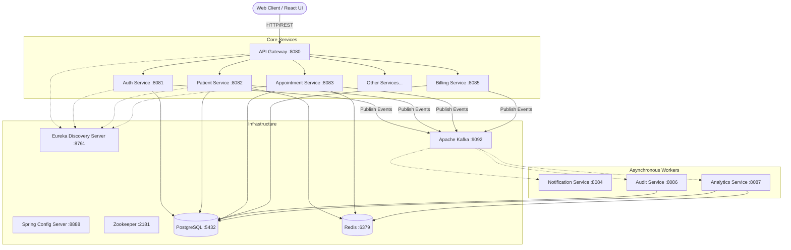

# Hospital Management System (HMS) - Fullstack Project

Welcome to the **Hospital Management System (HMS)**, an enterprise-grade, microservices-based application designed to manage hospital operations efficiently. This project leverages a modern tech stack to ensure high availability, scalability, and robust performance.

## 🌟 Overview

The HMS project is divided into a **React/TypeScript Frontend** and a **Spring Boot Microservices Backend**. It utilizes an event-driven architecture with Apache Kafka and robust data storage with PostgreSQL and Redis.

### Key Features
- **Patient Management:** Handle patient records, histories, and demographics.
- **Appointment Scheduling:** Book, manage, and track doctor appointments.
- **Billing & Invoicing:** Manage payments, invoices, and financial reporting.
- **Role-Based Access Control (RBAC):** Secure authentication and authorization using JWT.
- **Real-time Notifications:** Asynchronous event processing for email/SMS notifications.
- **Analytics & Auditing:** Comprehensive audit logs and analytics dashboards.
- **Inventory & Pharmacy:** Manage hospital inventory, lab tests, and pharmacy stocks.

---

## 🏗️ System Architecture

The application follows a distributed microservices architecture. All requests from the frontend client are routed through the API Gateway, which delegates them to the appropriate underlying microservices.



---

## 🚀 Tech Stack

### Frontend
- **Framework:** React 19 with TypeScript
- **Build Tool:** Vite
- **UI Library:** Material UI (MUI) v9 & Emotion
- **State Management:** Redux Toolkit
- **Routing:** React Router DOM
- **HTTP Client:** Axios

### Backend
- **Core:** Java 21, Spring Boot 3.5.0
- **Cloud/Microservices:** Spring Cloud (2025.0.0), Eureka, Config Server, API Gateway
- **Security:** Spring Security, JWT (JSON Web Tokens)
- **Utilities:** Lombok, MapStruct

### Infrastructure
- **Database:** PostgreSQL 16 (Multi-database setup)
- **Cache:** Redis 7 (Alpine)
- **Message Broker:** Apache Kafka & Zookeeper
- **Containerization:** Docker & Docker Compose

---

## 🛠️ Getting Started

### Prerequisites
- [Docker](https://www.docker.com/) & [Docker Compose](https://docs.docker.com/compose/)
- [Java 21](https://jdk.java.net/21/) (For local backend development)
- [Node.js](https://nodejs.org/) & npm (For local frontend development)

### Running the Entire Stack via Docker

We provide a comprehensive `docker-compose.yml` to spin up the entire infrastructure and microservices in one go.

1. **Clone the repository**
   ```bash
   git clone https://github.com/SujalGadhave/HMS-FULLSTACK.git
   cd HMS-FULLSTACK
   ```

2. **Set up environment variables**
   Copy `.env.example` to `.env` in both the root and `backend/` directories (if applicable) and configure your secrets (DB passwords, JWT secret, etc.).

3. **Start the cluster**
   ```bash
   docker-compose up -d
   ```
   *Note: This will build all backend Maven projects, the Vite frontend, and pull required infrastructure images. It might take a few minutes on the first run.*

4. **Access the application**
   - **Frontend UI:** [http://localhost:3000](http://localhost:3000)
   - **API Gateway:** [http://localhost:8080](http://localhost:8080)
   - **Eureka Dashboard:** [http://localhost:8761](http://localhost:8761)

### Stopping the Services
```bash
docker-compose down
```

---

## 📁 Repository Structure

```text
HMS-FULLSTACK/
├── backend/                  # Java/Spring Boot Microservices
│   ├── api-gateway/          # Edge server routing requests
│   ├── discovery-server/     # Eureka Service Registry
│   ├── config-server/        # Centralized configuration
│   ├── auth-service/         # JWT Authentication & User management
│   ├── patient-service/      # Patient records
│   ├── appointment-service/  # Scheduling
│   └── ...                   # Other domain services
├── frontend/                 # React + Vite Web Client
│   ├── src/                  # Components, Pages, Redux Slices
│   └── public/               # Static assets
└── docker-compose.yml        # Orchestration configuration
```

## 📚 Further Documentation

For more detailed information, please refer to the specific module readmes:
- [Frontend Documentation](./frontend/README.md)
- [Backend Documentation](./backend/README.md)
